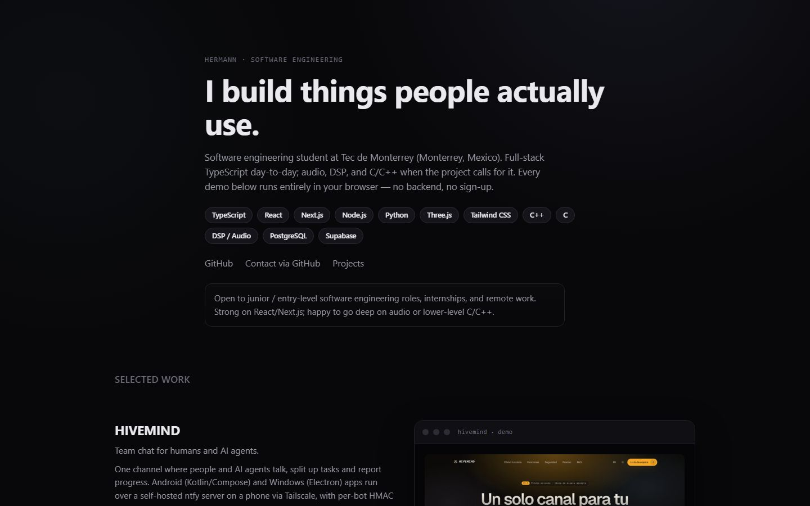
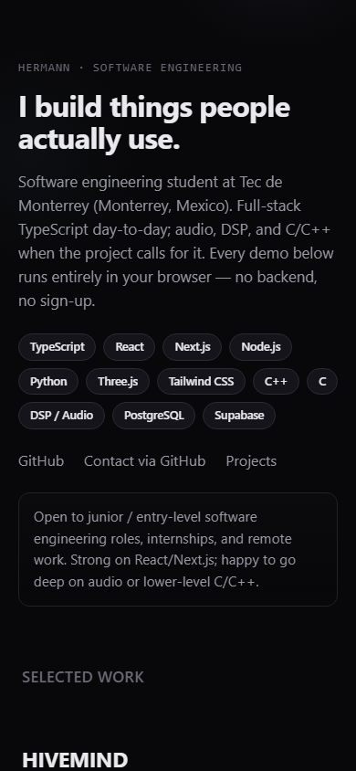

# Best Works

Página estática con un índice de mis mejores proyectos, con enlaces, stack y demos. Está pensada para que alguien que revise mi trabajo vea rápido de qué trata cada proyecto.

Corre completa en el navegador. No usa backend ni llaves de API, y los datos de las demos están escritos directo en el código, así que sigue funcionando aunque los sitios en producción estén caídos. La página está en inglés.

Sitio: https://hermannpr.github.io/best-works/





## Qué incluye

- Presentación corta y lista de tecnologías
- Proyectos seleccionados con descripción, stack y capturas
- Demos interactivas que funcionan sin conexión a un servidor

## Tecnologías

HTML, CSS y JavaScript sin frameworks.

## Cómo correrlo en local

```bash
git clone https://github.com/HermannPR/best-works
cd best-works
python3 -m http.server 5173
```

Después abre http://localhost:5173/ en el navegador.

## Estructura

- `index.html` es la página
- `assets/styles.css` tiene los estilos
- `assets/data.js` tiene los datos de los proyectos y de las demos
- `assets/app.js` pinta la página y maneja las demos
